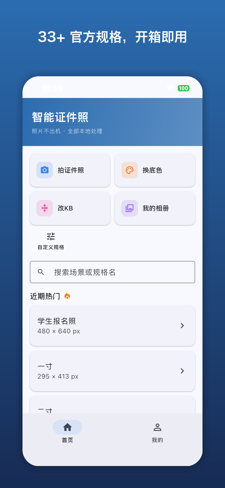
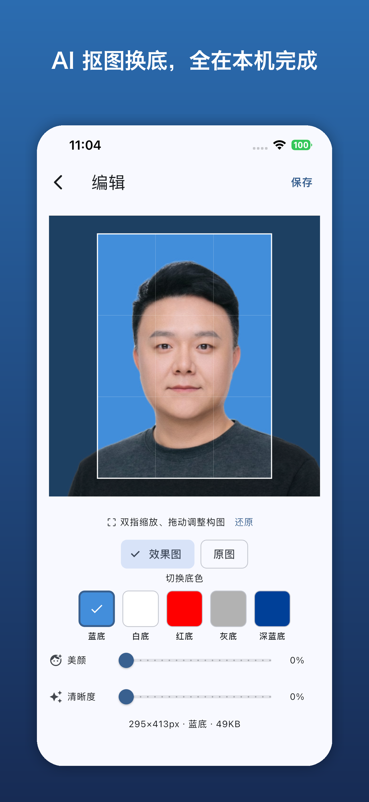
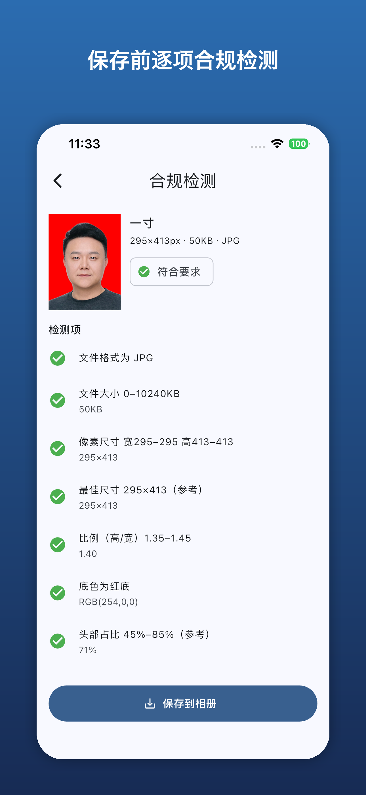

# 智能证件照 PhotoID

**English** | [中文](#中文)

## English

PhotoID is an AI-powered ID photo maker that runs **entirely on-device**. Take a photo or pick one from your gallery, and PhotoID handles background removal and replacement, automatic face-based framing and cropping, compliance checking, and saving with education-style ID filenames — **all locally, no photo ever leaves your phone**.

### Features

- 🏠 **Redesigned home** — brand header, 2×2 quick-action cards (shoot / recolor / resize KB / album), privacy banner and hot-spec picks; consistent on Android & iOS
- 📷 **Capture or import** — shoot directly in the app (front/back camera switch with a portrait outline guide) or pick an existing photo
- ✂️ **Hair-level cutout & five background colors** — on-device MODNet matting keeps fine hair strands, one-tap switch between blue / white / red / gray / dark-blue backgrounds, with a per-spec recommended default
- 🎯 **Auto framing & cropping** — locates the real hairline from the matte for composition; pads with the background color instead of cutting off the head or shoulders. Pinch/drag to fine-tune, ratio always locked
- 💆 **Retouch & clarity (two independent sliders, both default to 0)** — face-only smoothing / wrinkle & blemish removal / even skin tone / subtle slimming, plus whole-image sharpening and clarity
- ✅ **Compliance check** — format, file size (KB), pixel size, aspect ratio, background color, head ratio, head centering, and eyes-open checks against built-in specs
- 🎓 **Student ID photo (education ID naming)** — save files with student-style IDs for easy archiving
- 📚 **33+ built-in specs** — one-inch, two-inch, visa, exam and more, plus custom spec creation
- 🗜️ **KB resize tool** — recompress any photo into a target file-size range
- 🖼️ **My Album** — browse and manage saved ID photos locally
- 🌐 **Bilingual UI** — 中文 / English, switchable in-app
- 🔄 **In-app self-update (Android)** — GitHub Release based OTA update check; iOS international release is being prepared
- 🔒 **100% local processing** — no account, no upload, no watermark, works offline

### Screenshots

<!-- TODO: add screenshots to assets/screenshots/ -->
| Home | Edit | Result |
| --- | --- | --- |
|  |  |  |

### Tech Stack

- **Flutter 3.47.2** (Dart) — cross-platform UI
- **MODNet (ONNX Runtime)** — hair-level portrait matting, on-device inference
- **Google ML Kit** — Face Detection, on-device inference
- **image** + custom raw-buffer operators — compositing, resizing, retouching
- **gal / http / package_info_plus** — gallery saving, GitHub Release update check, version info
- Built-in spec library (`assets/photo_specs.json`) with 33+ specs describing dimensions and compliance rules

### Quick Start

```bash
git clone https://github.com/chunguangwei/photoid.git
cd photoid
flutter pub get
flutter run
```

See [docs/development.md](docs/development.md) for architecture, build, test and release details.

### Platform Support

- Android 8.0 (API 26)+
- iOS 15.5+

### Release Signing

Since v0.2.0, release builds are signed with a dedicated release keystore
(configured via the gitignored `android/key.properties`; without it the build
falls back to the debug signature, which must never be distributed). The
in-app updater only installs APKs signed with the **same** key — losing the
keystore means existing users can no longer upgrade and must reinstall.
**Back up the keystore file and its passwords.** Users coming from a
differently-signed build also need one uninstall/reinstall.

### License

Non-Commercial License — free for personal use; **commercial use requires the author's written permission: please contact chunguangwee@gmail.com.** See [LICENSE](LICENSE).

### Disclaimer

Compliance results are advisory only. The final acceptance of an ID photo is always determined by the reviewing authority. Verify against the official requirements of the target institution before submitting.

---

## 中文

PhotoID 是一款**纯端侧**的 AI 证件照制作应用。支持拍摄或从相册导入照片，自动完成智能抠图换底、基于人脸检测的自动构图裁剪、合规检测，并以教育 ID 命名方式保存——**全部在本地处理，照片不会上传到任何服务器**。

### 功能特性

- 🏠 **全新主页**——品牌渐变头 + 2×2 功能大卡（拍证件照 / 换底色 / 改 KB / 我的相册）+ 隐私横幅 + 热门规格，Android / iOS 双端一致
- 📷 **拍摄 / 上传**——应用内直接拍摄（支持前后置切换与人像轮廓参考框），或从相册导入现有照片
- ✨ **发丝级抠图 · 五色换底**——端侧 MODNet 抠图保留发丝细节，一键切换蓝 / 白 / 红 / 灰 / 深蓝五种底色，规格自带推荐默认色
- 🎯 **自动构图裁剪**——从抠图掩码定位真实发际线构图；画幅不够时用底色补边，不会切掉头顶或肩膀。支持双指缩放 / 拖动微调，比例始终锁定
- 💆 **美颜 · 清晰度双滑杆（默认均为 0）**——美颜只作用于人脸（磨皮 / 去皱去斑 / 匀肤 / 轻度瘦脸），清晰度作用于整图（锐化 / 通透度）
- ✅ **合规检测**——格式、文件大小（KB）、像素尺寸、宽高比例、底色、头部占比、居中、睁眼逐项校验
- 🎓 **学生报名照（教育 ID 命名）**——按学号式 ID 命名文件，便于归档管理
- 📚 **33+ 内置规格**——一寸、二寸、签证、考试报名等，支持自定义规格
- 🗜️ **改 KB 工具**——任意照片重新压缩到目标大小范围
- 🖼️ **我的相册**——本地浏览与管理已保存的证件照
- 🌐 **中英双语**——中文 / English，应用内切换
- 🔄 **Android 自升级**——基于 GitHub Release 的更新检查；iOS 海外版筹备中
- 🔒 **全部本地处理**——无需账号、不上传、无水印，离线可用

### 应用截图

<!-- TODO: 将截图补充到 assets/screenshots/ -->
| 首页 | 编辑 | 结果页 |
| --- | --- | --- |
|  |  |  |

### 技术栈

- **Flutter 3.47.2**（Dart）——跨平台 UI 框架
- **MODNet（ONNX Runtime）**——发丝级人像抠图，端侧推理
- **Google ML Kit**——Face Detection 人脸检测，端侧推理
- **image** 包 + 自研原始缓冲区算子——合成、缩放、精修
- **gal / http / package_info_plus**——相册保存、GitHub Release 更新检查、版本信息
- 内置规格库（`assets/photo_specs.json`），含 33+ 条规格，描述各证件照尺寸与合规规则

### 快速开始

```bash
git clone https://github.com/chunguangwei/photoid.git
cd photoid
flutter pub get
flutter run
```

架构、构建、测试与发布流程详见 [docs/development.md](docs/development.md)。

### 平台支持

- Android 8.0（API 26）及以上
- iOS 15.5 及以上

### 发布签名

自 v0.2.0 起，release 构建使用专用正式 keystore 签名（通过 gitignored 的
`android/key.properties` 配置；缺该文件时回退 debug 签名，**绝不可用于分发**）。
应用内自升级只接受**同签名**覆盖安装——keystore 丢失意味着老用户无法再升级，
只能卸载重装。**务必备份 keystore 文件及其密码**；从其他签名版本升级的用户
同样需要卸载重装一次。

### 许可证

本项目采用非商业许可证：个人使用免费；**商业使用需获得作者书面授权，请联系 chunguangwee@gmail.com。** 详见 [LICENSE](LICENSE)。

### 免责声明

合规检测结果仅供参考，证件照最终是否合格以官方审核为准。请在提交前自行核对待办机构的官方要求。
