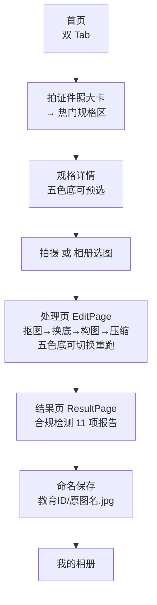

# PhotoID 产品文档（当前版本 v0.6.1）

> 本文档描述 **当前已实现** 的产品形态，随版本持续更新。
> 历史规划稿见 [智能证件照App_PRD_V1.0.md](智能证件照App_PRD_V1.0.md)（保留存档，不代表现状）。

- 当前版本：`0.6.1+36`（Android，GitHub Release tag `v0.6.1`）
- 平台：Android 8.0+（minSdk 26）/ iOS 15.5+
- 仓库：https://github.com/chunguangwei/photoid
- 联系：chunguangwee@gmail.com

---

## 1. 产品定位

**纯端侧 AI 证件照制作工具**：拍照或上传照片，一键完成人像抠图、
底色替换、人脸构图裁剪与合规压缩，直接产出符合规格要求的证件照 JPG。

核心卖点是**隐私**——全流程在设备本地完成（MODNet 端侧抠图模型 +
ML Kit 人脸检测 + 本地像素处理），**照片不出机**：无上传、无服务器、
无账号体系。首页首屏即展示隐私承诺条。

## 2. 功能清单（已实现）

### 2.1 页面结构

| 页面 | 内容 |
|---|---|
| 启动页 `splash_page` | 矢量绘制的品牌吉祥物（会眨眼、呼吸浮动），6 秒倒计时可跳过；底部预留广告位槽。这段空闲期同时预热抠图模型，缩短首张照片的等待 |
| 首页 Tab `home_page` | 品牌渐变头（App 名 + 隐私口号）→ 2×2 主功能大卡（拍证件照 / 换底色 / 改 KB / 我的相册）→ 次级小工具（自定义规格）→ 黄色隐私横幅 → 搜索框 → 近期热门规格（🔥，学生照锚点置顶）→ 「全部规格(33)」折叠区 |
| 我的 Tab `settings_page` | 我的相册入口 → 检查更新（仅 Android）→ 隐私说明 → 关于（版本号 / 许可证 / 联系邮箱） |
| 规格详情 `spec_detail_page` | 三栏参数卡（像素尺寸 / DPI 300 / 文件大小区间）→ 五色底色选择 chips（默认色带「· 推荐」标记，选中色贯穿拍摄/上传）→ 要求清单 → 底部「上传照片 / 立即拍摄」双按钮 |
| 拍摄 `camera_page` | 实时取景拍摄 + 3:4 取景框 + 人像轮廓虚线参考框（头圆 + 肩线，引导站位）；支持前置/后置切换（多摄设备显示切换按钮，默认后置），直进处理页 |
| 处理 `edit_page` | 流水线步骤进度（preparing→…→compressing 六项，配「扫描揭色」动效：照片从灰度逐行变彩色，直观表达处理进度）；高精修/普通档切换；五色底色切换即重跑；**美颜 / 清晰度双滑杆**；手势缩放平移的交互裁剪；原图/效果对比切换 |
| 结果 `result_page` | 成片预览 + 合规检测报告（11 项，硬/软分级）+ 保存（应用私有相册，可选写系统相册；学生报名照按教育 ID 命名） |
| 改 KB 工具 `kb_tool_page` | 已有照片压缩到目标 KB 区间 |
| 我的相册 `my_album_page` | 本地成片列表（时间倒序）、查看、删除 |
| 自定义规格 `custom_spec_page` | 自填像素 / KB 区间 / 比例等参数生成一次性规格 |
| 升级对话框 `update_dialog` | 新版本提示 → 下载 APK → 系统安装（仅 Android） |

主页为底部双 Tab 结构（首页 / 我的，NavigationBar）。首页「拍证件照」大卡
滚动定位到热门规格区——规格即拍摄入口；「换底色」大卡直接以学生报名照
规格进相册选图复用同一流水线。热门区按锚点（学生照 / 一寸 / 两寸 /
四六级 / 高考）各取一条，学生照置顶。

### 2.2 用户主流程

## 3. 规格体系

- **内置规格 33 条**（`assets/photo_specs.json`）：覆盖一寸/两寸、
  英语四六级（CET）、高考报名、学生报名照（教育 ID）等常用场景；
  每条规格定义像素尺寸、KB 区间、允许宽高范围、高宽比例范围、
  默认底色与要求清单。
- **数据修正（v0.2.0）**：英语四六级文件大小收紧为 20–200KB（原区间
  过宽，易产出过大文件）；驾驶证 / 驾驶证小一寸 / 中国护照底色改为
  **白底**（按官方要求）；结婚登记照底色改为**红底**。
- **自定义规格**：用户自填参数，满足长尾需求。
- **五色底色**：蓝 / 白 / 红 / 灰 / 深蓝，全规格通用。
  **默认推荐机制**：规格自带默认底色，详情页对应 chip 标注
  「· 推荐」，用户可改选任意一色，选中色贯穿拍摄与上传全流程，
  处理页可随时切换重跑。

## 4. 修图能力

### 4.1 抠图档位

| 档位 | 说明 |
|---|---|
| 普通版 | MODNet 抠图，出片快 |
| 高精修版 | 同一模型，额外一道轻锐化，发丝/轮廓更利落 |

抠图保留发丝的半透明过渡带，边缘白边通过**前景色解混**消除（而不是把
人物轮廓削掉一圈），头发、耳廓、肩线这类细结构不会丢失；同时人体主体
判定为完全不透明，不会出现「衣服往下逐渐溶进底色」。

模型偶发的误判会被自动修正：画面角落被错认成人的色块（建筑、地面）整块
清除，身体内部被错认成背景的斑点填实。

### 4.2 自动构图

以掩码测得的**真实发际线**（而非人脸框推算）定位头顶，头部占成片高约
62%、头顶留白约 11%、水平居下巴中线。

原图人物顶天立地时，裁剪框会**越界并用底色补齐**而不是切掉头顶或肩膀
——换底后背景是纯色，补边完全看不出来。仅底边不补色（身体下方悬空一块
纯色会很假），此时整体上移。

用户可在处理页用双指缩放 + 单指拖动微调取景，比例始终锁定规格比例，
不可能拉伸变形；「还原」可回到自动构图。

### 4.3 美颜与清晰度（两条独立通道，默认均为 0）

| 滑杆 | 作用对象 | 效果 |
|---|---|---|
| **美颜** | 人脸区域 | 磨皮、去细纹与色斑、匀肤，以及幅度 ≤4.5% 的轻度瘦脸 |
| **清晰度** | 整张照片 | 锐化、提升通透度与局部对比 |

拆成两条而不是一个「美颜」滑杆，是因为二者目标不同：想让皮肤更干净，
和想让整张照片更清晰锐利，混在一起必然互相拖累。

- **默认都是 0**，即不做任何修饰，输出与原图一致；用户主动拉大才生效。
- 磨皮只压制低幅度细节（毛孔、细纹、色斑），眼睑、唇线、鼻翼等五官结构
  原样保留，因此拉到 100% 也不会糊五官。
- 瘦脸幅度刻意做得很轻——证件照审核关注「与本人一致」，明显改脸型有
  合规风险。
- 调节时预览区叠加扫描动效（同一套视觉语言）表明正在处理；松手后自动重算，最终成片与
  预览走完全相同的参数与算法。
- 强度持久化，下次进处理页沿用上次的选择。

## 5. 合规检测（11 项）

对最终成片逐项检测，分**硬性**与**软性**两级——硬性项全过才算合规；
软性项不通过仅提示、不阻断保存。

| # | 检测项（CheckItem.id） | 级别 | 说明 |
|---|---|---|---|
| 1 | format | 硬 | 文件格式（流水线恒定输出 JPG） |
| 2 | fileSize | 硬 | 文件大小落在规格 [minFileKb, maxFileKb] |
| 3 | decodable | 硬 | 文件可正常解码 |
| 4 | pixelSize | 硬 | 像素尺寸在规格允许范围内 |
| 5 | bestSize | 软 | 恰好等于规格最佳像素尺寸 |
| 6 | ratio | 硬 | 高/宽比例在规格范围内 |
| 7 | blueBg | 硬 | 底色检测：四角采样与规格**目标底色**按 HSV 容差比对——低饱和目标（白/灰）比饱和度与明度，彩色目标（蓝/红/深蓝）比色相（±20°）；检测项文案随目标色显示「底色：{目标色}」（标识 `blueBg` 为历史命名） |
| 8 | faceDetected | 软 | 检测到人脸 |
| 9 | headRatio | 软 | 头部占比合规 |
| 10 | headCentered | 软 | 头部水平居中 |
| 11 | eyesOpen | 软 | 双眼睁开 |

每项附带实测值（如「486KB」「295×413」）与修复建议；软项不通过时
报告页给出重拍/重选提示。

## 6. 语言与本地化

- **双语**：简体中文 / English，跟随系统语言切换。
- zh 为回退：未匹配语言时回落中文。
- 翻译源为 `lib/l10n/app_zh.arb` / `app_en.arb`（120+ 键），服务层输出
  语义标识（流水线步骤、异常码、检测项 id），UI 层统一翻译。

## 7. 升级机制

- **Android**：应用内自升级。`UpdateService` 查询 GitHub
  `releases/latest`，semver 比较发现新版本后弹框，确认后下载 APK 并经
  FileProvider 触发系统安装。双触发：启动 3 秒后自动静默检查一次；
  「我的」Tab 的检查更新入口手动检查（无更新则提示「已是最新」）。任何
  网络/解析异常静默失败，不打扰用户。
  **正式签名（v0.2.0 起）**：release 使用正式 keystore 签名（本地
  `key.properties` 配置，gitignored）。自升级是同签名覆盖安装——
  v0.2.0 从 debug 签名切换到 release 签名，签名发生变更，**老用户需卸载
  重装一次**（应用私有相册数据随卸载清除，注意提前导出）；后续版本保持
  同一 keystore 即可无缝覆盖升级。
- **iOS**：`UpdateService` 平台守卫直接返回 null，走 App Store 审核更新。

## 8. 平台要求

| 平台 | 最低版本 | 分发 |
|---|---|---|
| Android | 8.0（API 26） | GitHub Release APK（自升级） |
| iOS | 15.5 | App Store |

**功能对齐**：修图能力（抠图、构图、美颜、清晰度）、启动页、应用图标、
交互裁剪在两端**完全一致**——均为纯 Dart 实现，无平台分支。

仅两处按平台差异化，均为既有设计：

| 差异点 | Android | iOS |
|---|---|---|
| 应用内升级 | 支持（下载 APK + FileProvider 安装） | 不提供，走 App Store |
| ML Kit 人脸检测输入 | NV21 字节流（`fromFilePath` 在部分机型 NPE） | `InputImage.fromFile` |

## 9. 未实现（规划中）

以下功能见于历史 PRD V1.1+ 规划，**当前版本未实现**：

- 换正装（服装替换）
- 人像精修（磨皮/祛痘等）
- 发型调整
- 萌宠证件照
- 冲印/打印配送
- 会员/付费体系

## 10. 指标与埋点

暂略——当前版本无埋点、无统计。后续版本规划补充。

---

## 相关文档

- [development.md](development.md) — 架构、流水线与发布流程
- [appstore.md](appstore.md) — 上架物料
- [智能证件照App_PRD_V1.0.md](智能证件照App_PRD_V1.0.md) — 历史规划稿（存档）
